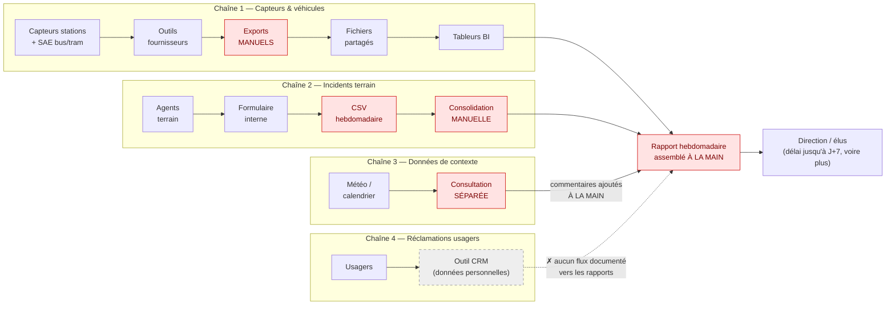

# 1. Rapport préliminaire — C1
## Projet MobilityPulse — Métropole de NovaVille

---

## 1.1 Contexte métier

La Métropole de NovaVille exploite un réseau de mobilité multimodal : bus, tramway, vélos en libre-service, parkings relais et zones piétonnes instrumentées *(pièce 00)*. Depuis deux ans, les réclamations des usagers augmentent : retards, ruptures de service, stations saturées, information voyageur incohérente entre application et panneaux *(pièces 00, 04)*.

Ces difficultés révèlent surtout les limites du système d'information : les données existent (capteurs, SAE bus/tram, incidents, météo, événements) mais sont éparpillées dans des outils cloisonnés, consolidées à la main et restituées avec plusieurs jours de retard *(pièces 01, 02)*.

La Direction Mobilité lance donc le programme **MobilityPulse** : concevoir une architecture de gestion de données qui consolide les flux de mobilité et produit des indicateurs fiables pour les métiers — premier lot cadré en moins de 3 mois, budget plafonné à 85 000 € *(pièce 01)*.

**Services concernés :** Direction Mobilité (commanditaire), centre de supervision, exploitation réseau et vélos, relation usagers, Direction événements, DSI, référents RGPD / accessibilité / RSE ; les élus sont destinataires des indicateurs *(pièces 01, 02, 04)*.

**Enjeux :** fiabiliser les indicateurs, réduire le délai de détection des anomalies, prioriser les interventions selon l'impact usager et préparer un futur composant IA — dans le respect du RGPD, du RGAA et de la sobriété numérique *(pièces 00, 01, 05)*.

---

## 1.2 Cartographie des flux existants

### Schéma des flux actuels

*(En rouge : les étapes manuelles. En pointillés : le silo non intégré. Schéma également disponible en annexe : `annexes/schemas_flux.md`.)*

**Lecture du schéma :** aucune chaîne n'est automatisée de bout en bout ; chacune comporte au moins une étape manuelle (en rouge), source de retards et d'erreurs. Les trois premières chaînes ne se rejoignent qu'au rapport hebdomadaire, assemblé à la main *(pièces 01, 02)* : la corrélation entre incidents, saturation et météo est faite « de tête » par les analystes. Les réclamations usagers restent cloisonnées dans le CRM : aucun flux documenté ne les relie aux rapports *(pièce 02)*. Selon le moment de l'événement, la direction est informée avec un délai pouvant atteindre 7 jours, davantage en cas de retard de saisie des incidents.

*Note — hypothèse : le dossier atteste les rapports hebdomadaires manuels (pièce 01) sans préciser leur outil d'assemblage ; le lien « tableurs BI → rapport » est une interprétation à confirmer en phase de cadrage.*

### Table des sources de données

| ID | Source | Fréquence | Volumétrie / jour | Format | Propriétaire | RGPD | Qualité | Problèmes connus |
|---|---|---|---|---|---|---|---|---|
| SRC01 | Capteurs stations vélos | 1 à 5 min | 250 000 événements | JSON / API fournisseur | Exploitation vélos | faible | moyenne | horodatages incohérents, doublons |
| SRC02 | SAE bus/tram | temps quasi réel | 900 000 événements | flux propriétaire | Exploitation réseau | faible à moyenne | moyenne | champs variables selon les lignes |
| SRC03 | Incidents terrain | saisie manuelle | 300 lignes | CSV exporté | Centre supervision | faible | **faible** | retards de saisie, typologies non normalisées |
| SRC04 | Météo horaire | horaire | 2 400 lignes | JSON API | DSI | nulle | bonne | coût API, disponibilité |
| SRC05 | Calendrier événements | hebdomadaire | 50 lignes | XLSX | Direction événements | nulle | moyenne | données non structurées |
| SRC06 | Réclamations usagers | quotidien | 800 tickets | export CRM | Relation usagers | **élevée** | moyenne | données personnelles en texte libre |

*Source : catalogue des sources (pièce 03) et cartographie des flux (pièce 02).*

**Constat clé :** deux sources (SRC01 et SRC02) concentrent environ 1 150 000 enregistrements par jour, soit **99,7 % du volume total en nombre d'enregistrements**. À l'inverse, la seule source sensible au titre du RGPD (SRC06) n'en représente que 0,07 %. Ce déséquilibre orientera les choix d'architecture (sobriété, rétention) et de conformité (minimisation). La colonne Fréquence montre par ailleurs que seules SRC01 et SRC02 relèvent du quasi temps réel : les quatre autres sources sont naturellement compatibles avec un traitement périodique.

---

## 1.3 Problématique métier

L'analyse du contexte et des flux existants conduit à formuler la problématique suivante :

> **« Comment consolider des flux de mobilité hétérogènes en une plateforme de données fiable et gouvernée, permettant de détecter plus rapidement les anomalies, dans le respect du RGPD, de l'accessibilité (RGAA) et de la sobriété numérique, avec un budget de 85 000 € et un premier lot cadré en 3 mois ? »**

Cette problématique se décompose en quatre sous-questions, qui structurent la suite du dossier :

1. **Quelles données consolider, avec quel niveau de qualité et à quelle fréquence ?** → traité dans le cahier des charges (C4)
2. **Quelles solutions techniques et quelles obligations réglementaires faut-il connaître pour choisir ?** → traité par la veille (C2-C3)
3. **Quel périmètre est réaliste avec 85 000 € et 3 mois, et qu'est-ce qui doit être reporté ?** → traité dans le cahier des charges (C4)
4. **Quelle architecture recommander et selon quels critères de décision ?** → traité dans les recommandations (C5)

---

## 1.4 Synthèse de l'existant

Les irritants relevés dans le dossier documentaire se classent en trois familles.

### Irritants de gouvernance
- **Absence de référentiel commun** des stations et des lignes : une même station peut ne pas être reconnue d'un système à l'autre *(pièces 02, 07)*.
- **Aucun dictionnaire de données partagé** : les indicateurs n'ont pas de définition officielle unique *(pièce 02)*.
- Conséquence : les chiffres des tableaux de bord sont **parfois contestés** par les équipes terrain *(pièce 01)* — risque de rejet métier évalué « probabilité forte, impact fort » *(pièce 07)*.
- Des **données personnelles circulent en texte libre** dans les réclamations (nom, téléphone), sans cadre de traitement formalisé *(pièces 02, 07)*.

### Irritants techniques
- **Événements hétérogènes selon les fournisseurs** *(pièce 01)* : horodatages incohérents et doublons sur les capteurs vélos, champs variables selon les lignes sur le SAE *(pièce 02)*.
- **Contrôles qualité non automatisés** : aucune vérification systématique des données reçues *(pièce 02)*.
- **Faible traçabilité des transformations** : difficile de justifier comment un chiffre a été obtenu *(pièce 02)*.
- **Rétention des exports non formalisée** *(pièce 02)*, avec un risque identifié de saturation du stockage par conservation indéfinie d'événements bruts *(pièce 07)*.

### Irritants organisationnels
- **Incidents saisis manuellement dans plusieurs outils** *(pièce 01)*, avec retards de saisie et typologies non normalisées *(pièce 02)*.
- **Exports et consolidations manuels** tout au long de la chaîne ; rapports de performance produits à la main chaque semaine *(pièces 01, 02)*.
- **Météo et calendrier consultés séparément**, sans intégration systématique : de simples commentaires ajoutés aux rapports *(pièces 01, 02)*.
- **Information voyageur incohérente** entre les canaux (application, panneaux) *(pièces 00, 04)*.
- **Indicateurs pas toujours accessibles** aux personnes en situation de handicap *(pièce 01)*.

### Points d'appui (l'existant n'a pas que des faiblesses)
- Les **données existent déjà** et couvrent tout le périmètre : capteurs vélos, SAE bus/tram, incidents, météo, événements, réclamations — environ 1,15 million d'enregistrements par jour *(pièce 03)*.
- Les **volumes restent maîtrisables** pour une architecture moderne : de l'ordre du Go par jour (hypothèse : ~1 Ko par enregistrement, à confirmer en cadrage).
- **Six KPI métier sont déjà esquissés** par la direction, chacun associé à une décision *(pièce 08)*.
- Les **parties prenantes sont identifiées et convergentes** sur le besoin de fiabilisation *(pièce 04)*.

### Limites de l'étude
- Les volumétries et coûts fournis sont **déclaratifs** (dossier documentaire) et devront être confirmés en phase de cadrage.
- L'étude ne comporte pas d'audit technique sur site : l'état réel des API fournisseurs est une **hypothèse à vérifier**.

---

## 1.5 Opportunité du projet

### Pourquoi une architecture data est la bonne réponse

Le diagnostic (1.4) montre que les difficultés de NovaVille ont une **cause racine commune** : l'absence d'un socle de données consolidé et gouverné. Traiter les symptômes un par un (recruter plus d'analystes, changer un outil isolé) reproduirait le problème. Un projet d'architecture de gestion de données traite la cause : **collecter automatiquement, normaliser sur un référentiel commun, contrôler la qualité, exposer des indicateurs définis une seule fois et consommés partout**.

### Bénéfices attendus par partie prenante

| Partie prenante | Bénéfice attendu |
|---|---|
| Direction Mobilité | Indicateurs fiables partageables avec les élus ; pilotage par l'impact usager |
| Exploitation / supervision | Détection des anomalies en minutes plutôt qu'en jours ; priorisation des interventions |
| Relation usagers | Une seule vérité diffusée sur tous les canaux ; communication crédible |
| DSI | Intégration au SI, suppression des flux redondants et du shadow IT |
| Référent RGPD | Minimisation par conception : le lot 1 fonctionne sans donnée personnelle |
| Référent accessibilité | Dashboards conformes RGAA dès la conception, sans rattrapage coûteux |
| Responsable RSE | Rétention maîtrisée, fréquences proportionnées, stockage piloté par un KPI de sobriété |

### Le coût de l'inaction

Sans projet : les réclamations continuent d'augmenter, les décisions restent fondées sur des chiffres contestés, les exports s'accumulent sans limite (risque de saturation), et les données personnelles présentes dans les réclamations demeurent traitées sans cadre (risque RGPD latent).

### Un prérequis pour l'ambition IA

La direction envisage à moyen terme un composant d'IA de prédiction des anomalies *(pièce 00)*. Or un modèle prédictif n'est fiable que si les données qui l'alimentent le sont : **le socle de données proposé ici est le prérequis indispensable** à cette ambition. Le projet crée donc de la valeur immédiate (indicateurs fiables) tout en préparant la suite.
