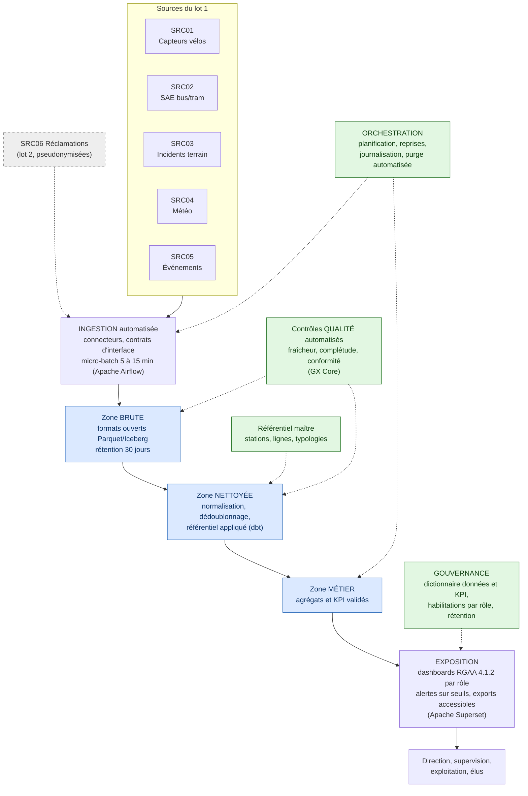

# 3. Cahier des charges — C4
## Projet MobilityPulse — Métropole de NovaVille

---

## 3.1 Objectifs SMART

Les objectifs ci-dessous traduisent la commande de la direction *(pièces 00, 01)* en engagements mesurables et datés. Le dossier impose un cadrage du premier lot en moins de 3 mois *(pièce 01)* ; le présent cahier des charges retient un lot 1 jalonné sur 3 mois : cadrage validé à M+1, socle de données et ingestion à M+2, tableaux de bord et recette à M+3.

| # | Objectif | Mesure | Échéance |
|---|---|---|---|
| O1 | Automatiser l'ingestion des 5 sources du lot 1 (SRC01 à SRC05), en supprimant toute étape manuelle de collecte | 100 % des sources du lot 1 ingérées sans intervention manuelle | M+3 |
| O2 | Réduire le délai de détection des anomalies, aujourd'hui de plusieurs jours (rapport hebdomadaire) | Délai moyen de détection inférieur à 15 minutes sur les flux capteurs et SAE | M+3 |
| O3 | Restaurer la confiance dans les chiffres par un dictionnaire de données et de KPI validé par les métiers | 100 % des indicateurs diffusés couverts par une définition validée | M+3, avant mise en service des tableaux de bord |
| O4 | Fiabiliser les flux entrants par des contrôles qualité automatisés | Taux de fiabilité des flux (événements conformes / reçus) supérieur ou égal à 95 % | M+3 |
| O5 | Mettre à disposition des tableaux de bord accessibles pour 3 profils (direction, supervision, exploitation) | Audit d'accessibilité RGAA 4.1.2 réalisé avant mise en service | M+3 |
| O6 | Maîtriser l'empreinte de stockage dès la conception | Volume total conservé inférieur à 50 Go à un an, mesuré par le KPI de sobriété | M+12 |

---

## 3.2 Périmètre et hors périmètre

### Inclus au lot 1 (3 mois, 85 000 €)

- Ingestion automatisée des sources SRC01 à SRC05 avec contrats d'interface fournisseurs.
- Référentiel maître des stations, lignes et typologies d'incident, validé par les métiers.
- Contrôles qualité automatisés à l'ingestion et tableau de suivi de la fiabilité des flux.
- Stockage en trois zones (brut, nettoyé, métier) sur formats ouverts.
- Tableaux de bord accessibles (RGAA 4.1.2) pour 3 profils, avec alertes simples sur seuils.
- Dictionnaire de données et de KPI publié et consultable.
- Politique de rétention appliquée et purge automatisée (détail en partie 3.8).

### Reporté au lot 2

- Intégration des réclamations usagers (SRC06) après pseudonymisation, avis du référent RGPD et inscription au registre des traitements.
- Streaming temps réel (latence inférieure à la minute), uniquement si le besoin est confirmé par l'usage du lot 1.
- Alerting avancé (corrélations multi-sources, notifications ciblées).
- Publication des données de la métropole au Point d'Accès National (obligation LOM identifiée par la veille).

### Envisagé au lot 3

- Composant IA de prédiction des anomalies *(pièce 00)*, conditionné à la qualité des données constatée sur le lot 1 et au cadre AI Act (transparence dès août 2026, haut risque à décembre 2027 le cas échéant).

### Hors périmètre (exclusions fermes reprises du dossier, pièce 00)

- Pilotage automatique des feux de circulation.
- Décision automatisée sans validation humaine.
- Tracking individuel des usagers.
- Application mobile grand public complète.

### Exclusions complémentaires proposées

- Remplacement des outils fournisseurs existants (SAE, CRM) : le projet consomme leurs données, il ne s'y substitue pas.
- Reprise d'historique des exports manuels antérieurs : qualité invérifiable, coût disproportionné ; l'historique démarre à la mise en service.

---

## 3.3 Sources de données retenues

| ID | Source | Décision | Justification |
|---|---|---|---|
| SRC01 | Capteurs stations vélos | **Lot 1** | Volume majeur (250 000 évts/jour), cœur du besoin de supervision ; nécessite dédoublonnage et normalisation des horodatages |
| SRC02 | SAE bus/tram | **Lot 1** | 78 % du volume, source principale des indicateurs de retard ; contrat d'interface indispensable (champs variables) |
| SRC03 | Incidents terrain | **Lot 1** | Petit volume mais critique métier ; normalisation des typologies via le référentiel |
| SRC04 | Météo horaire | **Lot 1** | Corrélation anomalies/conditions météo demandée par la direction ; intégration simple (API JSON) |
| SRC05 | Calendrier événements | **Lot 1** | Volume négligeable (50 lignes/semaine), forte valeur d'anticipation des pics ; structuration du tableur en référentiel événements |
| SRC06 | Réclamations usagers | **Lot 2** | Seule source à sensibilité RGPD élevée (0,07 % du volume) ; le référent RGPD demande une exploitation agrégée ou pseudonymisée *(pièce 04)* ; son report rend le lot 1 totalement exempt de données personnelles |

---

## 3.4 Besoins fonctionnels

| # | Besoin | Bénéficiaires |
|---|---|---|
| BF1 | Consulter des tableaux de bord par profil (direction, supervision, exploitation), accessibles au sens RGAA | Tous |
| BF2 | Être alerté en cas de dépassement de seuil (station saturée, retard anormal, rupture de flux) | Supervision, exploitation |
| BF3 | Suivre un incident de bout en bout avec une typologie normalisée | Supervision |
| BF4 | Croiser les anomalies avec la météo et le calendrier des événements | Exploitation, direction |
| BF5 | Consulter la définition officielle de chaque indicateur (dictionnaire intégré) | Tous |
| BF6 | Exporter données et rapports dans des formats accessibles et réutilisables | Tous |
| BF7 | Tracer l'origine d'un chiffre (source, transformations appliquées, date de calcul) | DSI, supervision |
| BF8 | Gérer les habilitations par rôle, avec journalisation des accès | DSI |

---

## 3.5 Besoins techniques et architecture cible

### Exigences techniques

| # | Exigence |
|---|---|
| ET1 | Ingestion automatisée et planifiée, avec contrat d'interface par fournisseur et tests de non-régression sur les schémas |
| ET2 | Stockage en trois zones (brut, nettoyé, métier) sur formats ouverts (Parquet/Iceberg) pour garantir la réversibilité |
| ET3 | Normalisation systématique sur le référentiel maître (stations, lignes, typologies) |
| ET4 | Contrôles qualité automatisés à l'ingestion : fraîcheur, complétude, conformité, dédoublonnage |
| ET5 | Orchestration centralisée avec gestion des reprises sur erreur et journalisation des traitements |
| ET6 | Exposition via un outil de tableaux de bord compatible avec les exigences RGAA |
| ET7 | Sécurité : accès par rôle, secrets chiffrés (aucun mot de passe en clair), journalisation des accès *(pièce 05)* |
| ET8 | Hébergement sur le SI de la métropole ou un hébergeur européen de confiance, aligné avec la DSI *(pièce 04)* |
| ET9 | Latence cible du lot 1 en micro-batch (5 à 15 minutes), extensible vers le temps réel au lot 2 sans refonte |

### Architecture cible

L'architecture s'organise en couches, chaque brique transverse répondant à un risque identifié dans le dossier *(pièce 07)* :

Lecture : en bleu les trois zones de données, en vert les briques transverses, en pointillés gris la source reportée au lot 2. Chaque brique verte neutralise un risque de la matrice (référentiel contre les incohérences, qualité contre le rejet métier, orchestration contre la saturation, gouvernance contre les indicateurs contestés).

Le même schéma figure en annexe (schéma 3 du document annexes/schemas_flux.md). Pour le document Word, insérer une capture d'écran du rendu GitHub à cet emplacement.

**Technologies pressenties** (issues de la veille, versions vérifiées au 20/07/2026 ; la décision finale est argumentée dans le rapport C5) : Apache Airflow 3.3 (orchestration), dbt-core 1.12 (transformations tracées), GX Core 1.19 (qualité), Apache Superset 6.1 (tableaux de bord), Parquet/Iceberg (stockage). Socle 100 % open source sous licence Apache 2.0, sans coût de licence.

---

## 3.6 Contraintes et risques

### Contraintes

- **Budget** : 85 000 € au total *(pièce 06)*, atteint au plafond exact fixé par la direction. La marge pour risques (5 000 €, soit 5,9 %) est inférieure aux standards de projet (10 à 15 %). Le périmètre resserré du lot 1 (report de SRC06) et le choix open source (zéro licence) constituent les deux leviers retenus pour sécuriser cette enveloppe.
- **Délais** : cadrage du premier lot en moins de 3 mois *(pièce 01)* ; jalons à M+1, M+2 et M+3 (détail en partie 3.1).
- **Disponibilité métier** : les ateliers de validation (référentiel, dictionnaire, KPI) mobilisent les équipes d'exploitation et de supervision ; leur indisponibilité est un risque planifié (voir matrice).
- **Dépendances externes** : API des fournisseurs de capteurs et du SAE (schémas variables), API météo (coût et disponibilité).
- **Compétences** : montée en compétence de l'équipe sur les outils retenus ; le choix d'outils standards et documentés limite ce risque.

### Répartition budgétaire *(pièce 06)*

| Poste | Montant | Commentaire |
|---|---|---|
| Ateliers métier et cadrage | 12 000 € | Entretiens, cartographie, validation du besoin |
| Architecture et sécurité | 18 000 € | Schémas, choix techniques, risques, RGPD |
| Socle données initial | 25 000 € | Référentiels, ingestion pilote, qualité |
| Tableaux de bord pilote | 16 000 € | KPI exploitation, maquettes, accessibilité |
| Tests et documentation | 9 000 € | Recette, guides, transfert |
| Marge risques | 5 000 € | Aléas fournisseurs et disponibilité métier |
| **Total** | **85 000 €** | Plafond direction atteint, sans réserve complémentaire |

### Matrice des risques (reprise du dossier, pièce 07, et enrichie)

| # | Risque | Probabilité | Impact | Mesure de maîtrise | Porteur |
|---|---|---|---|---|---|
| R1 | Données incohérentes entre fournisseurs | Forte | Fort | Référentiel maître et règles de mapping (lot 1) | Équipe data |
| R2 | Données personnelles dans les réclamations | Moyenne | Fort | SRC06 reportée au lot 2, pseudonymisation et avis DPO avant intégration | Référent RGPD |
| R3 | Saturation du stockage par les flux temps réel | Moyenne | Moyen | Rétention 30 jours du brut, agrégation progressive, purge automatisée | Équipe data |
| R4 | Rejet métier des indicateurs | Forte | Fort | Dictionnaire KPI validé en atelier avant diffusion, définitions publiées | Direction Mobilité |
| R5 | Inaccessibilité des tableaux de bord | Moyenne | Moyen | Critères RGAA 4.1.2 intégrés aux spécifications, audit avant mise en service | Référent accessibilité |
| R6 | Changement de schéma API fournisseur sans préavis | Moyenne | Moyen | Contrats d'interface et tests de non-régression automatisés | DSI |
| R7 | Dérive du périmètre en cours de lot | Moyenne | Fort | Comité d'arbitrage mensuel, toute demande nouvelle passe au lot suivant | Chef de projet |
| R8 | Indisponibilité des équipes métier pour les ateliers | Moyenne | Moyen | Calendrier des ateliers fixé au démarrage, suppléants désignés | Direction Mobilité |
| R9 | Dépassement de l'enveloppe (marge de 5,9 % seulement) | Moyenne | Fort | Suivi budgétaire mensuel, périmètre lot 1 resserré, socle sans coût de licence | Chef de projet |

---

## 3.7 RGPD, RGAA, RSE et éthique

### RGPD : décisions prises

- **Le lot 1 ne traite aucune donnée personnelle** : la seule source sensible (SRC06) est reportée au lot 2. Minimisation par conception, conforme à la demande du référent RGPD *(pièce 04)*.
- Chaque traitement est inscrit au **registre des activités de traitement** de la métropole (finalité, durées, mesures de sécurité), conformément à l'article 30 du RGPD.
- Les durées de conservation suivent le cycle de vie CNIL en trois phases (détail en partie 3.8).
- Pour le lot 2 : pseudonymisation des réclamations dès l'ingestion, clé de correspondance conservée séparément sous la responsabilité du DPO, analyse d'impact (AIPD) si l'analyse préalable la juge nécessaire. La veille rappelle que des données pseudonymisées restent des données personnelles ; seule une agrégation anonymisante les sort du champ RGPD.
- Accès par rôle et journalisation des accès aux données sensibles *(pièce 05)*.

### RGAA : décisions prises

- Conformité **RGAA 4.1.2** (version en vigueur vérifiée par la veille) intégrée aux spécifications des tableaux de bord dès la conception, et non en rattrapage.
- Critères appliqués : contrastes suffisants, navigation clavier complète, alternatives textuelles, aucune information portée uniquement par la couleur, exports accessibles.
- Audit d'accessibilité avant mise en service (objectif O5) et déclaration d'accessibilité publiée.
- Revue de conformité planifiée à la publication du RGAA 5 (annoncé pour fin 2026 ; les déclarations antérieures restent valables 18 mois).

### RSE et sobriété numérique : décisions prises

- Fréquences de collecte **proportionnées au besoin réel** : micro-batch de 5 à 15 minutes au lot 1, le temps réel n'étant activé au lot 2 que sur besoin confirmé. Référence : RGESN v2 et recommandations ADEME identifiées par la veille.
- **Agrégation progressive** : les données fines sont agrégées dès que possible, le brut n'est conservé que 30 jours.
- **Estimation d'impact chiffrée** (hypothèse : 1 Ko par enregistrement, à confirmer en cadrage) : environ 1,15 Go par jour en brut, soit près de 420 Go par an si tout était conservé indéfiniment. Avec la politique retenue (30 jours de brut glissants et agrégats au-delà), le volume à un an est estimé sous 50 Go, soit une réduction d'un facteur 8 à 10. Le KPI de sobriété (partie 3.9) suit cet engagement.
- Pas de duplication inutile des données : une seule zone de référence par niveau de raffinement, exigence portée par la DSI *(pièce 04)*.

### Éthique : principes de conception

- Aucune décision automatisée sans validation humaine (exclusion ferme du dossier, érigée en principe de conception).
- Transparence des indicateurs : chaque KPI diffusé renvoie à sa définition publiée dans le dictionnaire.
- Les données d'incidents sont rattachées à des équipes et des lignes, jamais à des agents individuels.
- Le futur composant IA (lot 3) respectera le calendrier AI Act identifié par la veille : transparence dès août 2026, exigences haut risque à décembre 2027 si la qualification s'appliquait.

---

## 3.8 Cycle de vie des ressources numériques

Le cycle de vie suit les trois phases CNIL (base active, archivage intermédiaire, suppression ou archivage définitif), vérifiées par la veille (page CNIL mise à jour le 02/04/2026). La purge est automatisée par l'orchestrateur et journalisée.

| Ressource | Création | Base active (usage courant) | Archivage intermédiaire | Suppression / sort final |
|---|---|---|---|---|
| Événements bruts capteurs et SAE | Ingestion continue | 30 jours (contrôles qualité, rejeu en cas d'incident) | Aucun (agrégats produits avant purge) | Purge automatique à 30 jours |
| Agrégats horaires | Calcul quotidien orchestré | 24 mois (tableaux de bord opérationnels) | 36 mois supplémentaires | Suppression à 5 ans |
| Agrégats journaliers et mensuels | Calcul quotidien orchestré | 5 ans (analyses pluriannuelles) | Conservation en statistiques anonymes | Archivage définitif anonyme |
| Incidents normalisés | Ingestion depuis SRC03 | 24 mois | 3 ans supplémentaires (retours d'expérience) | Suppression à 5 ans |
| Météo et calendrier événements | Ingestion API et tableur | 24 mois | Aucun | Suppression à 24 mois |
| Réclamations pseudonymisées (lot 2) | Ingestion avec pseudonymisation immédiate | 12 mois | Aucun | Suppression, ou conservation en agrégats anonymes uniquement |
| Journaux d'accès et de traitements | Génération continue | 6 mois | Aucun | Purge automatique |
| Référentiels et dictionnaire | Ateliers métier | Permanent, versionné | Sans objet | Documentation vivante du projet |

---

## 3.9 Indicateurs de réussite

### KPI métier (repris du dossier, pièce 08, avec cibles)

| KPI | Définition | Cible lot 1 | Décision associée |
|---|---|---|---|
| Délai moyen de détection | Temps entre événement terrain et alerte consolidée | Moins de 15 minutes | Améliorer la supervision |
| Fiabilité des flux | Événements conformes / événements reçus | 95 % ou plus | Piloter la qualité fournisseurs |
| Taux d'anomalies critiques | Incidents critiques / événements surveillés | Base de référence établie à M+1, objectif de réduction fixé ensuite | Prioriser les interventions |
| Taux de stations saturées | Stations au-dessus du seuil de saturation | Base de référence établie à M+1 | Rééquilibrage des vélos |
| Indice d'impact usager | Combinaison retard, volume estimé, criticité | Définition validée en atelier métier | Arbitrage opérationnel |
| Sobriété stockage | Volume conservé par niveau de détail | Moins de 50 Go à un an | Politique de rétention |

### KPI de réussite du projet

| Indicateur | Cible |
|---|---|
| Sources du lot 1 ingérées automatiquement | 5 sur 5, zéro consolidation manuelle restante sur le périmètre |
| Couverture du dictionnaire | 100 % des KPI diffusés ont une définition validée |
| Conformité accessibilité | Audit RGAA 4.1.2 réalisé avant mise en service, déclaration publiée |
| Adoption | Au moins 70 % des utilisateurs cibles actifs 3 mois après la mise en service |
| Budget | Enveloppe de 85 000 € respectée, suivi mensuel |
| Conformité RGPD | Zéro donnée personnelle constatée dans les zones de données du lot 1 |
