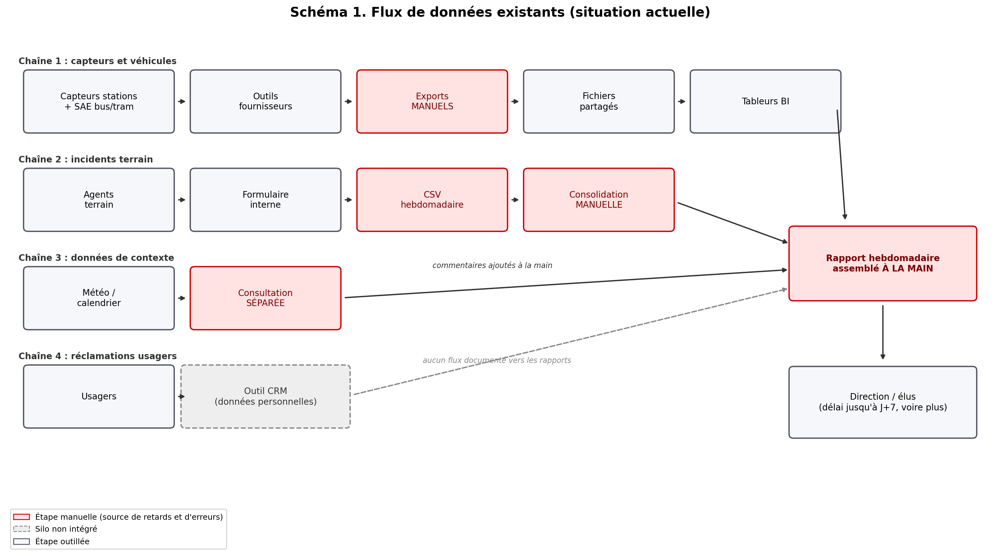
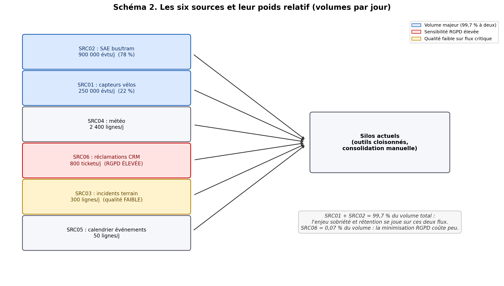
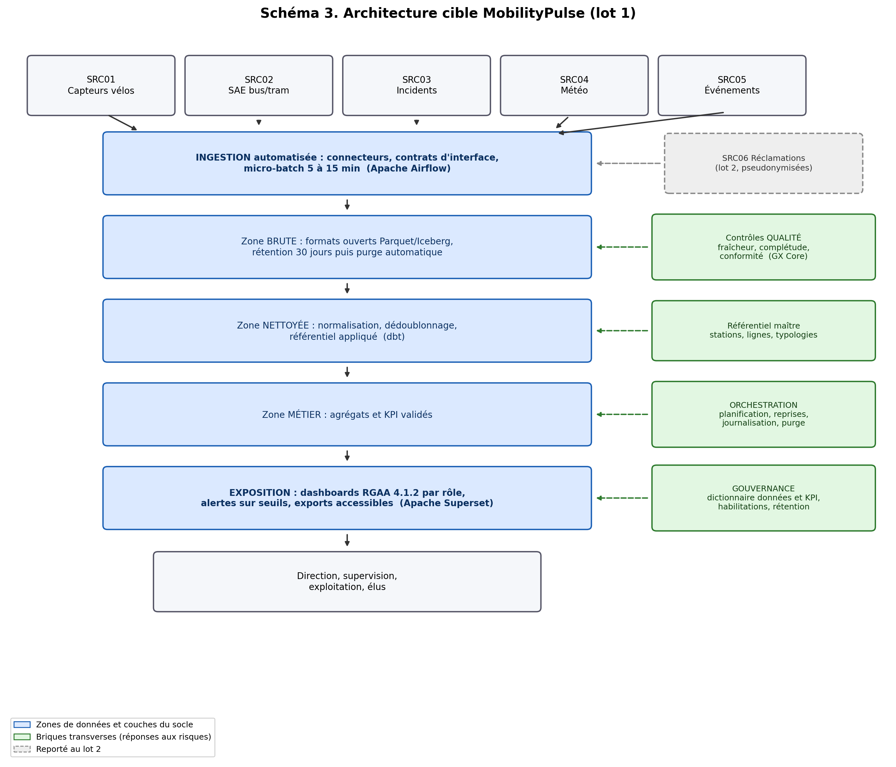

# 5. Annexes
## Projet MobilityPulse — Métropole de NovaVille

---

## Annexe A. Schéma des flux existants

Les quatre chaînes de données actuelles. En rouge : les étapes manuelles, sources de retards et d'erreurs. En pointillés : les réclamations usagers, cloisonnées dans le CRM sans flux documenté vers les rapports. Les trois premières chaînes ne se rejoignent qu'au rapport hebdomadaire assemblé à la main ; la direction est informée avec un délai pouvant atteindre 7 jours *(pièces 01, 02)*.

---

## Annexe B. Poids relatif des sources de données

Deux sources concentrent 99,7 % du volume quotidien (en nombre d'enregistrements) : l'enjeu de sobriété se joue sur elles. La seule source sensible RGPD pèse 0,07 % du volume : sa mise à l'écart du lot 1 coûte très peu de valeur métier *(pièce 03)*.

---

## Annexe C. Architecture cible (lot 1)

Le socle retenu : ingestion automatisée en micro-batch, trois zones de données sur formats ouverts, exposition accessible. Chaque brique transverse (en vert) neutralise un risque de la matrice *(pièce 07)*. La source SRC06 (en pointillés) rejoindra le dispositif au lot 2, pseudonymisée.

---

## Annexe D. Matrice des risques

Reprise du dossier documentaire *(pièce 07)* et enrichie (risques R7 à R9).

| # | Risque | Probabilité | Impact | Mesure de maîtrise | Porteur |
|---|---|---|---|---|---|
| R1 | Données incohérentes entre fournisseurs | Forte | Fort | Référentiel maître et règles de mapping (lot 1) | Équipe data |
| R2 | Données personnelles dans les réclamations | Moyenne | Fort | SRC06 reportée au lot 2, pseudonymisation et avis DPO avant intégration | Référent RGPD |
| R3 | Saturation du stockage par les flux temps réel | Moyenne | Moyen | Rétention 30 jours du brut, agrégation progressive, purge automatisée | Équipe data |
| R4 | Rejet métier des indicateurs | Forte | Fort | Dictionnaire KPI validé en atelier avant diffusion, définitions publiées | Direction Mobilité |
| R5 | Inaccessibilité des tableaux de bord | Moyenne | Moyen | Critères RGAA 4.1.2 intégrés aux spécifications, audit avant mise en service | Référent accessibilité |
| R6 | Changement de schéma API fournisseur sans préavis | Moyenne | Moyen | Contrats d'interface et tests de non-régression automatisés | DSI |
| R7 | Dérive du périmètre en cours de lot | Moyenne | Fort | Comité d'arbitrage mensuel, toute demande nouvelle passe au lot suivant | Chef de projet |
| R8 | Indisponibilité des équipes métier pour les ateliers | Moyenne | Moyen | Calendrier des ateliers fixé au démarrage, suppléants désignés | Direction Mobilité |
| R9 | Dépassement de l'enveloppe (marge de 5,9 % seulement) | Moyenne | Fort | Suivi budgétaire mensuel, périmètre lot 1 resserré, socle sans coût de licence | Chef de projet |

---

## Annexe E. Matrice de décision

Comparaison des deux options d'architecture (détail dans le rapport de recommandations C5). Notes de 1 à 5, pondérées selon les priorités du dossier.

| Critère | Poids | Option A : socle micro-batch | Option B : streaming temps réel |
|---|---|---|---|
| Coût (respect de l'enveloppe de 85 000 €) | 25 % | 5 | 2 |
| Délai (lot 1 en 3 mois) | 20 % | 5 | 2 |
| Conformité (RGPD, RGAA, sécurité) | 15 % | 4 | 4 |
| Sobriété numérique | 15 % | 5 | 2 |
| Simplicité d'exploitation et compétences | 15 % | 4 | 2 |
| Évolutivité (temps réel, IA) | 10 % | 4 | 5 |
| **Score pondéré (sur 5)** | | **4,6** | **2,6** |

**Décision : option A retenue pour le lot 1**, conçue prête pour le streaming afin de préserver l'évolution vers le temps réel au lot 2 si l'usage le justifie.

---

## Annexe F. Tableau des sources de veille

Les 25 sources ont été vérifiées en ligne le 20/07/2026 et notées avec la grille de qualification du rapport de veille (autorité, actualité, fiabilité, utilité, sur 12). Le détail des apports figure dans le rapport C2-C3.

| Thème | Source | Date / version constatée | Score |
|---|---|---|---|
| Réglementaire | CNIL, durées de conservation | Mise à jour 02/04/2026 | 12/12 |
| Réglementaire | CNIL, guide sécurité des données personnelles | Édition 2024 | 12/12 |
| Réglementaire | CNIL, anonymisation et pseudonymisation | 19/05/2020 | 11/12 |
| Réglementaire | CNIL, registre des traitements | Page 2018, art. 30 en vigueur | 11/12 |
| Réglementaire | RGPD, règlement (UE) 2016/679 | Texte consolidé | 12/12 |
| Accessibilité | RGAA 4.1.2 (DINUM) | 18/04/2023, en vigueur | 12/12 |
| Accessibilité | DesignGouv, annonce du RGAA 5 | 02/03/2026 | 12/12 |
| Réglementaire | AI Act, règlement (UE) 2024/1689 | Vérifié 07/07/2026 | 12/12 |
| Réglementaire | Data Governance Act, règlement (UE) 2022/868 | Vérifié 03/07/2026 | 10/12 |
| Technologie | Doc officielle Apache Airflow | v3.3.0, 06/07/2026 | 12/12 |
| Technologie | Doc officielle dbt-core | v1.12.0, 16/07/2026 | 12/12 |
| Technologie | Doc GX Core (Great Expectations) | v1.19.0, 07/2026 | 12/12 |
| Technologie | Doc officielle Apache Superset | v6.1.0, 13/05/2026 | 12/12 |
| Technologie | Doc officielle Apache Kafka | v4.3.1, 25/06/2026 | 11/12 |
| Technologie | Doc officielle Metabase et sa licence | v0.62.5, 16/07/2026 | 11/12 |
| Technologie | Annonce DuckDB 1.5.0 | 09/03/2026 | 11/12 |
| Technologie | Doc officielle Apache Spark | v4.2.0, 14/07/2026 | 10/12 |
| Technologie | Dépôt Soda Core (licence ELv2) | v4.17.1, 15/07/2026 | 9/12 |
| Sobriété | RGESN v2 (Arcep/Arcom, loi REEN) | Mai 2024, en vigueur | 12/12 |
| Sobriété | ADEME, numérique responsable collectivités | Mise à jour 16/01/2026 | 12/12 |
| Sobriété | Green IT, 115 bonnes pratiques (5e éd.) | Juin 2025 | 11/12 |
| Mobilité | gtfs.org, standard GTFS/GTFS-RT (MobilityData) | Consulté 20/07/2026 | 12/12 |
| Mobilité | transport.data.gouv.fr (Point d'Accès National) | Consulté 20/07/2026 | 12/12 |
| Mobilité | NeTEx / SIRI, standards CEN | Consulté 20/07/2026 | 10/12 |
| Mobilité | Observatoire des politiques locales de mobilité (Cerema/GART) | Millésime 2025 | 10/12 |

---

## Annexe G. Glossaire

| Terme | Définition |
|---|---|
| SAE | Système d'aide à l'exploitation : plateforme qui suit en temps réel les véhicules de transport (positions, retards, interruptions) |
| Batch / micro-batch / streaming | Traitement des données par lots périodiques (heures), par petits lots fréquents (minutes), ou en continu (secondes) |
| ETL | Chaîne Extraire, Transformer, Charger : le parcours automatisé d'une donnée depuis sa source jusqu'à son exploitation |
| Lakehouse | Architecture combinant la souplesse d'un lac de données et les garanties d'un entrepôt de données |
| Parquet / Iceberg | Formats de fichiers et de tables ouverts pour le stockage analytique, lisibles par de nombreux moteurs, gage de réversibilité |
| Zone brute / nettoyée / métier | Les trois niveaux de raffinement du socle : données telles que reçues, données normalisées, indicateurs prêts à l'usage |
| Référentiel maître | Liste unique et officielle des entités partagées (stations, lignes, typologies d'incident) |
| Dictionnaire de données | Document décrivant chaque donnée et indicateur : définition, source, propriétaire, sensibilité |
| Contrat d'interface | Engagement formalisé avec un fournisseur sur le format et le contenu des données échangées |
| Orchestration | Planification et enchaînement automatiques des traitements, avec reprise sur erreur et journalisation |
| Apache Airflow / dbt / GX Core / Superset | Les quatre briques open source du socle : orchestration, transformations SQL tracées, contrôles qualité, tableaux de bord |
| Pseudonymisation | Remplacement réversible des identifiants ; la donnée reste personnelle au sens du RGPD |
| Anonymisation | Suppression irréversible du lien avec la personne ; la donnée sort du champ du RGPD |
| RGPD | Règlement général sur la protection des données (UE 2016/679) |
| RGAA | Référentiel général d'amélioration de l'accessibilité ; version 4.1.2 en vigueur, RGAA 5 annoncé pour fin 2026 |
| RGESN | Référentiel général d'écoconception des services numériques (Arcep/Arcom, 78 critères) |
| AI Act | Règlement européen sur l'intelligence artificielle (UE 2024/1689), applicable par paliers de 2025 à 2027 |
| GTFS / GTFS-RT | Standard mondial de description des réseaux de transport, en version horaires théoriques / temps réel |
| LOM / PAN | Loi d'orientation des mobilités / Point d'Accès National (transport.data.gouv.fr) où la métropole doit publier ses données |
| KPI | Indicateur clé de performance, associé à une décision métier |
| Licence Apache 2.0 | Licence open source permissive : usage libre, sans coût de licence ni dépendance éditeur |
