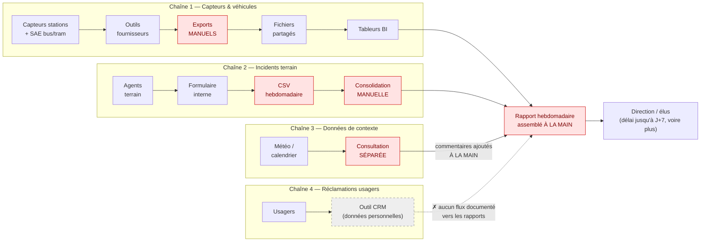
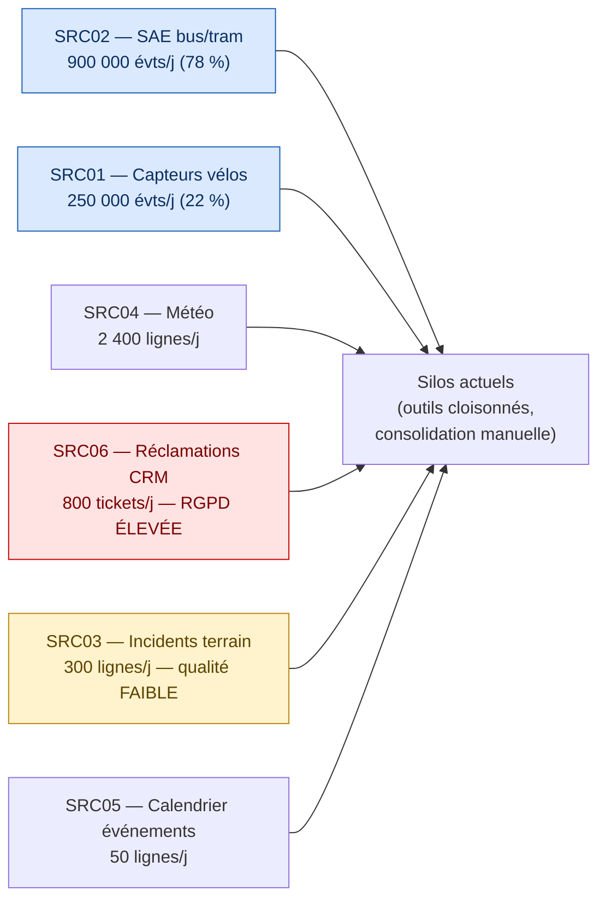
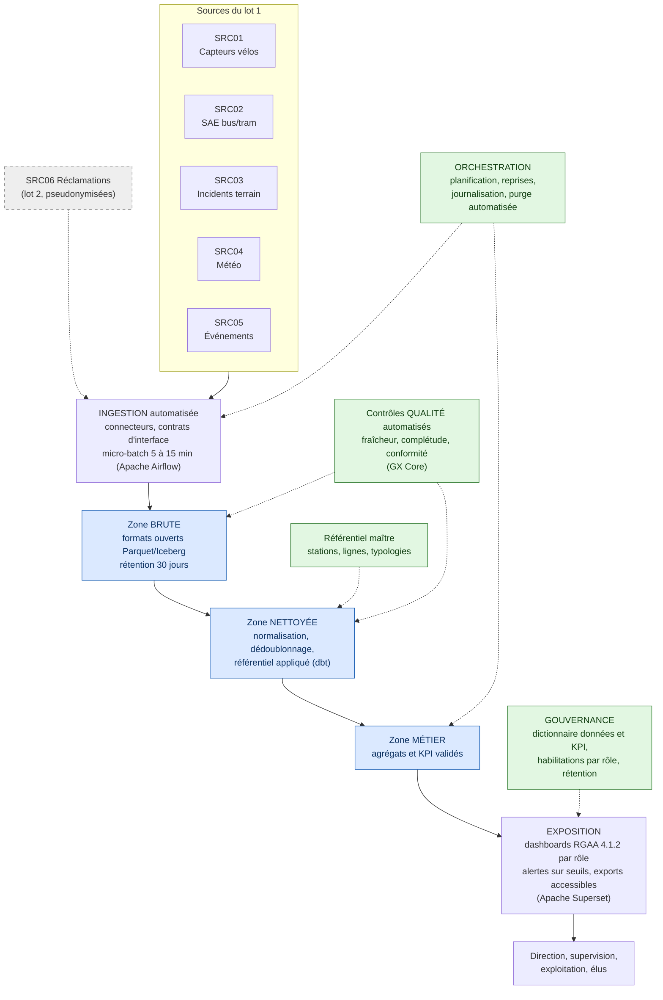

# Annexe — Schémas des flux de données
## Projet MobilityPulse — Métropole de NovaVille

---

## Schéma 1 — Flux existants (situation actuelle)

> Source : cartographie des flux (pièce 02). En rouge : les étapes manuelles.

**Constats :** aucune chaîne automatisée de bout en bout ; chaque chaîne comporte au moins une étape manuelle (en rouge). Les trois premières chaînes ne se rejoignent qu'au rapport hebdomadaire assemblé à la main ; les réclamations usagers (SRC06) restent cloisonnées dans le CRM, sans flux documenté vers les rapports. Délai d'information de la direction : jusqu'à 7 jours, davantage en cas de retard de saisie.

*Hypothèse signalée : les rapports hebdomadaires manuels sont attestés (pièce 01) mais leur outil d'assemblage n'est pas précisé ; le lien « tableurs BI → rapport » est une interprétation à confirmer.*

---

## Schéma 2 — Les 6 sources et leur poids relatif

> Source : catalogue des sources (pièce 03). Volumes par jour.

**Constats :** deux sources concentrent **99,7 % du volume** (en bleu) → l'enjeu sobriété/rétention se joue sur elles. Une seule source est sensible RGPD (en rouge) et ne pèse que 0,07 % du volume → minimisation facile. La qualité la plus faible (en jaune) touche le flux le plus critique pour le métier.

---

## Schéma 3 — Architecture cible (alignée sur le cahier des charges C4)

**Lecture :** en bleu les trois zones de données, en vert les briques transverses, en pointillés gris la source reportée au lot 2. Chaque brique verte neutralise un risque de la matrice de la pièce 07 : le référentiel contre les incohérences entre fournisseurs, les contrôles qualité contre le rejet métier des indicateurs, l'orchestration et la purge contre la saturation du stockage, la gouvernance contre les définitions contestées.
